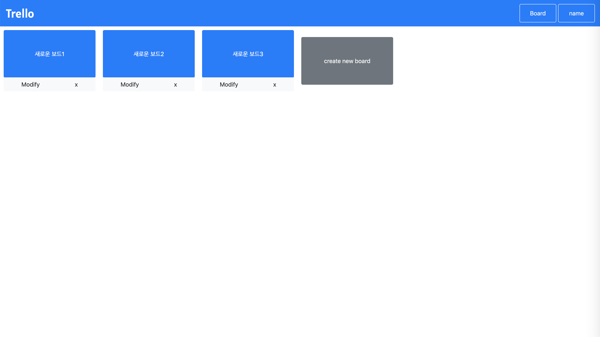

# trello_client
todo application인 trello의 기본 기능들을 클론한 프로젝트입니다. 
회원가입 탈퇴 수정 과 보드,컨테이너,카드의 추가,수정,삭제가 가능하며 카드의 컨테이너간 이동이 가능합니다. 



# 앱 실행 화면
<<<<<<< HEAD
<iframe width="1635" height="779" src="https://www.youtube.com/embed/7x2Oy8dD7o8" frameborder="0" allow="accelerometer; autoplay; encrypted-media; gyroscope; picture-in-picture" allowfullscreen></iframe>
=======
[](https://youtu.be/7x2Oy8dD7o8)
>>>>>>> 297a28f8b6809248546b70137a62f856361b23b8

# Front-end Skill
react, bootstrap, reactstrap

<<<<<<< HEAD
#설치 방법
=======
# 설치 방법
>>>>>>> 297a28f8b6809248546b70137a62f856361b23b8
```sh
npm install
```

<<<<<<< HEAD
#업데이트 내역
=======
# 업데이트 내역
>>>>>>> 297a28f8b6809248546b70137a62f856361b23b8
* 0.1.0
    * 첫 출시
